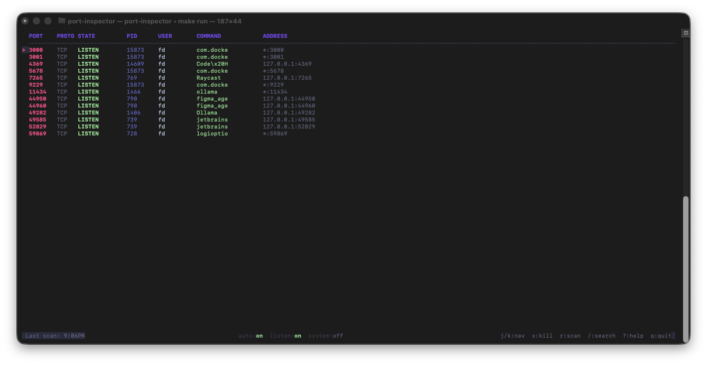

# port-inspector

A lazygit-style terminal UI for inspecting which processes are using network ports on macOS.



## Features

- **Live port scanning** via `lsof` -- see every process with an open network connection
- **Process details** -- port, protocol, state, PID, user, command, address, CPU, memory, start time
- **Kill processes** -- SIGTERM (`x`) or SIGKILL (`X`) with confirmation dialog
- **Search** -- filter by port number, process name, user, or any field
- **Listen-only filter** -- toggle to show only LISTEN connections
- **System process hiding** -- macOS system daemons (rapportd, sharingd, ControlCenter, etc.) hidden by default
- **Manual + auto-refresh** -- manual scan by default, toggle 3-second auto-refresh with `a`
- **Mouse support** -- click to select, click again to open details, scroll wheel to navigate
- **IPv4/IPv6 deduplication** -- processes binding both address families show as a single row
- **Vim-style navigation** -- `j`/`k`, `g`/`G`, `Ctrl+d`/`Ctrl+u`
- **Catppuccin color theme**

## Requirements

- **macOS** (relies on `lsof -i -n -P`)
- **Go 1.21+** (to build from source)

## Installation

### Using `go install`

```bash
go install github.com/agahfurkan/simple-port-inspector@latest
```

The binary will be placed in your `$GOPATH/bin` (or `$HOME/go/bin`). Make sure that directory is in your `PATH`.

### Clone and install

```bash
git clone https://github.com/agahfurkan/simple-port-inspector.git
cd simple-port-inspector
make install
```

This builds a stripped binary and copies it to `/usr/local/bin/port-inspector`. You may need `sudo make install` if you get a permission error.

### Manual build

```bash
git clone https://github.com/agahfurkan/simple-port-inspector.git
cd simple-port-inspector
go build -o port-inspector .
./port-inspector
```

## Usage

```bash
port-inspector
```

No arguments needed. The app opens in full-screen alt-screen mode and performs an initial port scan immediately.

## Key Bindings

### Navigation

| Key | Action |
|-----|--------|
| `j` / `Down` | Move down |
| `k` / `Up` | Move up |
| `g` | Go to top |
| `G` | Go to bottom |
| `Ctrl+d` | Half page down |
| `Ctrl+u` | Half page up |
| `Enter` | View process details |
| Click | Select row |
| Click again | Open details |
| Scroll wheel | Scroll list |

### Actions

| Key | Action |
|-----|--------|
| `x` | Kill process (SIGTERM) |
| `X` | Force kill process (SIGKILL) |
| `r` | Scan ports |
| `a` | Toggle auto-refresh (3s interval) |
| `l` | Toggle listen-only filter |
| `s` | Toggle system processes visibility |

### Search

| Key | Action |
|-----|--------|
| `/` | Open search |
| `Enter` | Apply search |
| `Esc` | Cancel search |
| `Ctrl+l` | Clear search |

### General

| Key | Action |
|-----|--------|
| `?` | Toggle help screen |
| `q` / `Esc` | Quit or go back |
| `Ctrl+c` | Quit |

## Status Bar

The bottom status bar shows three live indicators:

| Indicator | Toggle | Description |
|-----------|--------|-------------|
| `auto` | `a` | Auto-refresh on/off |
| `listen` | `l` | Listen-only filter on/off |
| `system` | `s` | System processes visible/hidden |

Green means on, muted means off.

## Built With

- [Go](https://go.dev)
- [Bubble Tea](https://github.com/charmbracelet/bubbletea) -- TUI framework
- [Bubbles](https://github.com/charmbracelet/bubbles) -- TUI components
- [Lip Gloss](https://github.com/charmbracelet/lipgloss) -- Style definitions

## License

MIT
